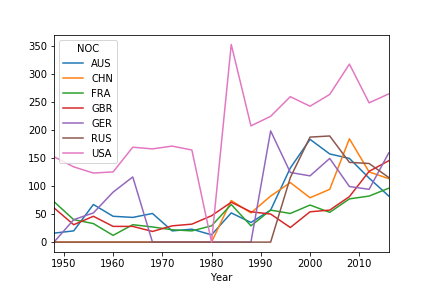

# Project 1 Group 1
* Tristan Holmes
* Angie
* Ty Sorensen
* Ryan Dickson

## Project Outline.
* This project attempted to answer diverse questions regarding the Summer 2020 Olympics. Data was taken as .csvs from Kaggle, the World Bank, and other verifiable sources.

## Can we predict the top 5 medal winning countries at the Summer 2020 Olympics?
* Looking at countries that won a large number (75 or more) medals at the 2016 Olympics and charting their performance over time, it appears some combination of Australia, China, France, Britain, Germany, Russia, and the United States will be the top five medal winners at the 2020 games.
