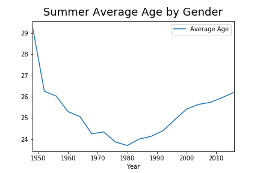
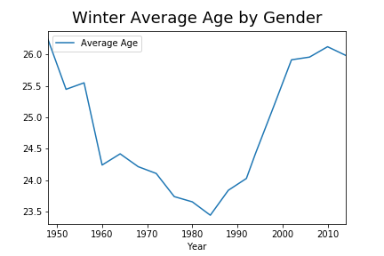
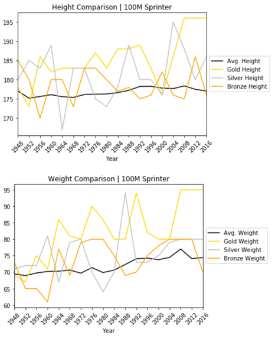
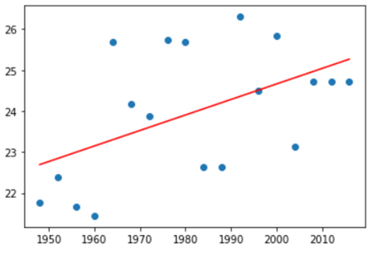
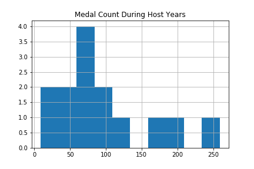
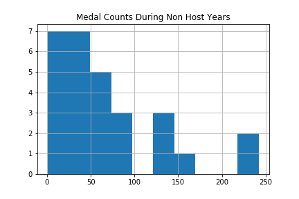

# Project 1 Group 1
* Ryan Dickson
* Tristan Holmes
* Angie Ong
* Ty Sorensen

## Motivation
With the 2020 Summer Olympic games upcoming, we were interested in analyzing data and making predictions for Tokyo. This was further motivated by a lack of Olympic research, especially prediction, on cursory examination. We were interested in identifying factors that predict medal success on both a country wide and individual basis.

## Goals
We attempted to find answers to the following questions:
* How have the demographics of the athletes changed over time?
* Does Body Mass Index (BMI) predict medal success? We use the men's 100m dash as a case study.
* Is GDP predictive of medal success for countries?
* Is there a host country advantage that can be seen in the medal count?

## Data Munging
Web scraped data was obtained from [Kaggle](https://www.kaggle.com/heesoo37/120-years-of-olympic-history-athletes-and-results). GDP data from 2000 to 2018 was taken from the [World Bank](https://data.worldbank.org/indicator/NY.GDP.MKTP.CD) For consistency in events and other factors, only data post WWII was considered. Further, the data was broken down by Summer and Winter games and analyses run separately.

## Participant Demographics
The average age of participants in both the Summer and Winter games declined steadily after WWII until the 1980s, at which point it began to increase again.

The number of female medal winners (and hence the number of women's events) has increased steadily for both the Summer and Winter games.

The mean height and weight of participants in both the Summer and Winter games has slowly but steadily increased since the end of WWII, but seems to have leveled off in recent years.

## BMI For Men's 100m Dash
Upon analysis, gold medal winners appear to be taller and heavier than the average sprinter in this event. Since 1948, gold medal winner weight has increased from 69 to 95 kgs, an increase of 38% or 26kg (57 lbs). Since 1956, gold medalists have been heavier than the average sprinter every year. That said, there is a fairly high degree of variance between medal winners from year to year. 3-time gold medalist Usain Bolt is a very tall strong runner compared to previous medalists dating back to WWII. 

We attempted to answer the question whether BMI predicts gold medal winners for the men's 100m dash over time. Using a linear regression on time versus BMI returned results of r equal to .51 and r squared equal to .26. This indicates about 25% of the variation in medal success is accounted for by BMI. We can predict with a low degree of certainty that 100M sprinter gold medalist in summer 2020 games will have BMI of 25.3.

## GDP Versus Medal Success

GDP data was sourced from the World Bank. There was a large amount of missing data for GDP for certain countries which had to be cleaned during the analysis. The cleaned GDP dataset was then merged with the Olympics dataset. A regression analysis was performed for the most recent summer and winter games. The r squared values ranged from .17 to .75, with larger values typical for summer games. 

## Host Country Advantage

We attempted to answer the question whether there is a correlation between hosting the games and an increase in medal count for the host country. Our analysis concentrated on the summer games in anticipation of Tokyo 2020. Data for host countries was found [online](https://www.downloadexcelfiles.com/wo_en/download-excel-file-list-olympic-host-cities#.XjW0N2hKhPY).

Testing revealed that the distribution of medal counts for host years was not close to normal. The solution was to take the difference in a country’s medal count between the years when a country hosted the summer games and the average of the summer games before and after. The Wilcoxon test was applied to this new dataset. According to this test, we reject the null hypothesis.

## Post Mortem

Given more time and resources, it would be interesting to gain access to a sports information API that had more detailed data. Freely available API's were lacking on this topic. Several further questions occured during the investigation. Does the presence and prominence of professional sports leagues for a given event affect medal count for countries that have them? How big an effect have performance enhancing drugs had on past events? Does population size correlate with a higher medal count?